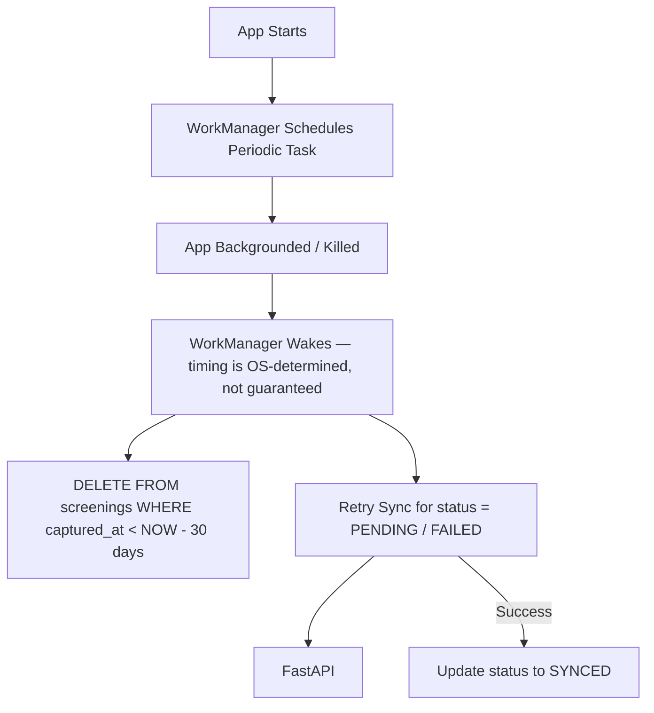

# ANAMOAI TECHNICAL STACK & IMPLEMENTATION BLUEPRINT
**Version:** 1.2 (P0 Fixes Applied)
**Status:** FINAL - Approved for Phase 1
**Target Platform:** Android 8.0+ (Offline-First)
**Team Size:** 6 Engineers

---

## Changelog (v1.1 → v1.2)

| # | Change | Why |
| :-- | :-- | :-- |
| 1 | Added `UNABLE_TO_ASSESS` to risk enums | Prevents forcing a Low/Moderate/High classification on a technically bad capture |
| 2 | Split `screenings` into `screenings` + `captures` | Enables repeat-measurement (3 max / 2 valid min / median) instead of one-shot capture |
| 3 | Added `algorithm_version`, `threshold_version`, `app_version` columns | Without these, two study records can't be proven to come from the same algorithm |
| 4 | Rewrote WorkManager deletion/sync language | v1.1 implied guaranteed timing ("wakes 6 hours later," "ensures deletion occurs on time"). WorkManager makes no such guarantee. |
| 5 | Replaced build-time secret injection with device-token auth | `--dart-define-from-file` keeps the key out of git, not out of the APK. Extractable via reverse engineering regardless. |
| 6 | Added `capture_quality` breakdown columns | Was a single opaque `quality_gate_result` JSON blob; now queryable per sub-score |
| 7 | Added Research Mode / ASHA Mode flag | Same data, two projections — worker-facing vs. researcher-facing |

---

## 1. Technology Matrix & Version Pinning

| Component | Technology / Library | Version | Notes |
| :--- | :--- | :--- | :--- |
| **Frontend** | Flutter (Stable) | `3.22.0` | `android:usesCleartextTraffic="false"` in manifest. |
| **State Management** | `flutter_bloc` / `Cubit` | `8.1.4` | Manages capture state machine (Searching → Positioning → ... → Capturing) and repeat-measurement counter. |
| **Permissions** | `permission_handler` | `11.3.0` | Android 13+ location (Bluetooth linkage) + Camera. |
| **Camera** | `camera` (Flutter Dev) | `0.10.5` | `ResolutionPreset.medium`, target 20 FPS. |
| **Face Mesh** | `google_mlkit_face_mesh_detection` | `^0.12.0` | `dependency_overrides` required to test on Android 8.0 (API 26). |
| **Background Tasks** | `flutter_workmanager` | `0.5.2` | See §2 — timing language corrected in v1.2. |
| **Local DB** | `sqflite` + `sqflite_sqlcipher` | `2.3.3` / `3.0.2` | AES-256 at rest. |
| **Secure Storage** | `flutter_secure_storage` | `9.2.2` | Stores AES DB key **and** device auth token (see §3.2). |
| **PDF Engine** | `pdf` | `3.10.7` | Font bytes loaded via `rootBundle` on UI thread, passed into isolate via `compute`. |
| **Sharing** | `share_plus` | `9.0.0` | Native Share Sheet, `FileProvider`. |
| **Backend** | FastAPI (Python) | `0.110.0` | Async endpoint. |
| **Backend DB** | PostgreSQL (Primary) / SQLite (Fallback) | `15.0` | `ON CONFLICT DO UPDATE` enforces "Local Wins." |
| **Image Compute** | Dart Isolate (`compute`) | N/A | Laplacian variance + CIELAB conversion off the UI thread. |

---

## 2. Background Processing Architecture (Corrected Timing Language)

*Addressing FR-LS.005 (Deletion) and FR-SY.006 (Auto-Retry).*



**v1.2 correction:** Records become **eligible for deletion at 30 days** and are **permanently deleted at the earliest available execution of the retention worker** thereafter. WorkManager's `PeriodicWorkRequest` minimum interval is 15 minutes but Doze mode, battery optimization, and OEM task-killers can delay execution by hours. Do not promise exact timing anywhere in the PRD, UI copy, or study documentation.

The sync and deletion jobs are now split into two independent workers so a missing network connection never blocks retention:

- **`RetentionWorker`** — no network constraint, runs on device idle, deletes records past the 30-day eligibility window.
- **`SyncWorker`** — requires `NetworkType.connected`, retries `PENDING`/`FAILED` records with exponential backoff (capped at 60s per attempt within a run).

```dart
await Workmanager().registerPeriodicTask(
  "retention_worker",
  "retention_worker",
  frequency: const Duration(hours: 6), // best-effort, not guaranteed
  constraints: Constraints(networkType: NetworkType.notRequired),
);

await Workmanager().registerPeriodicTask(
  "sync_worker",
  "sync_worker",
  frequency: const Duration(hours: 6),
  constraints: Constraints(networkType: NetworkType.connected),
);
```

---

## 3. High-Risk Deep-Dives (Corrected)

### 3.1 PDF Font Loading (Isolate Safety) — unchanged from v1.1
```dart
final bytes = await rootBundle.load('assets/fonts/NotoSansTelugu-Regular.ttf');
final pdfFile = await compute(generatePdf, PdfParams(patientName, results, bytes));
```

### 3.2 Authentication (Redesigned — replaces v1.1 §3.2)

**v1.1 problem:** `--dart-define-from-file=secrets.json` keeps a static API key out of version control, but the key still ships inside the compiled APK and is extractable via reverse engineering (`strings`, JADX, Frida). A single static key compromised on one device compromises every device.

**v1.2 fix — device-scoped tokens, not a shared static secret:**

```text
First launch
  ↓
App generates a device UUID (uuid v4) + keypair on-device
  ↓
POST /api/v1/devices/register  { device_id, public_key, org_code }
  ↓
Backend issues a short-lived device token (JWT, signed, ~30 day expiry)
  ↓
Token stored in flutter_secure_storage (Android Keystore-backed)
  ↓
Every /api/v1/sync request signs the payload with the device's private key
  ↓
FastAPI verifies: (1) token not expired/revoked, (2) signature matches registered public key
```

- No shared secret is baked into the binary. Compromising one APK exposes nothing usable against the backend — only device-specific keys leave the device, and those are Keystore-backed (non-exportable on API 23+).
- Backend can revoke a single device without rotating a key that every installed APK shares.
- `org_code` (issued to each ASHA center) scopes registration so an unauthorized device can't self-register against the study backend.

```sql
CREATE TABLE devices (
    device_id TEXT PRIMARY KEY,
    public_key TEXT NOT NULL,
    org_code TEXT NOT NULL,
    registered_at TIMESTAMPTZ NOT NULL DEFAULT now(),
    revoked_at TIMESTAMPTZ NULL
);
```

This is scoped for the 14-day prototype: no OAuth server, no refresh-token rotation flow — just registration + signed requests + revocation. Good enough to be honest about in a study writeup; a static build-time key is not.

---

## 4. Project Folder Structure

```
anamoai_app/
├── android/app/src/main/AndroidManifest.xml
├── assets/fonts/ (NotoSansTelugu.ttf, NotoSansDevanagari.ttf)
├── lib/
│   ├── main.dart
│   ├── src/
│   │   ├── core/
│   │   │   ├── constants/ (disclaimer_strings.dart)
│   │   │   ├── database/ (db_helper.dart, models/)
│   │   │   ├── background/ (retention_worker.dart, sync_worker.dart)  // split, was one file
│   │   │   ├── auth/ (device_registration.dart, token_store.dart)     // NEW
│   │   │   └── network/ (sync_client.dart, api_interceptor.dart)
│   │   ├── features/
│   │   │   ├── capture/ (capture_state_machine.dart, quality_gate_bloc.dart, repeat_measurement.dart) // NEW
│   │   │   ├── results/ (results_screen.dart, research_mode_view.dart) // NEW
│   │   │   └── pdf_export/ (pdf_generator.dart)
│   │   └── utils/
│   │       └── isolates/ (cielab_converter.dart)
└── backend/
    └── app/routers/ (sync.py, devices.py)  // devices.py NEW
```

---

## 5. Local Database Schema (v1.2 — split into `screenings` + `captures`)

```sql
-- One row per FINAL screening (aggregated result, what ASHA mode shows)
CREATE TABLE screenings (
    screening_id TEXT PRIMARY KEY,
    captured_at TEXT NOT NULL,

    anemia_risk TEXT CHECK(anemia_risk IN ('LOW','MODERATE','HIGH','UNABLE_TO_ASSESS')),
    jaundice_risk TEXT CHECK(jaundice_risk IN ('LOW','MODERATE','HIGH','UNABLE_TO_ASSESS')),

    -- final values = median of valid captures, not a single-shot reading
    anemia_a_star REAL,
    jaundice_b_star REAL,
    valid_capture_count INTEGER NOT NULL DEFAULT 0,

    final_quality_score REAL,           -- 0-100, technical capture quality, NOT a medical confidence

    -- versioning — mandatory, non-null
    algorithm_version TEXT NOT NULL,
    threshold_version TEXT NOT NULL,
    app_version TEXT NOT NULL,

    quality_override INTEGER DEFAULT 0,
    device_model TEXT,
    fitzpatrick_scale INTEGER,
    fitzpatrick_assessment_method TEXT CHECK(fitzpatrick_assessment_method IN ('SELF_REPORTED','WORKER_ASSESSED')),
    ambient_lighting TEXT CHECK(ambient_lighting IN ('INDOOR_NATURAL','INDOOR_ARTIFICIAL','OUTDOOR_SHADE','OUTDOOR_DIRECT')),

    sync_status TEXT DEFAULT 'PENDING' CHECK(sync_status IN ('PENDING','SYNCED','FAILED')),
    consent_recorded_at TEXT,
    deleted_at TEXT NULL
);

-- One row per individual capture attempt (up to 3), feeds Research Mode
CREATE TABLE captures (
    capture_id TEXT PRIMARY KEY,
    screening_id TEXT NOT NULL REFERENCES screenings(screening_id) ON DELETE CASCADE,
    capture_index INTEGER NOT NULL CHECK(capture_index BETWEEN 1 AND 3),

    -- per-capture quality breakdown (was one opaque JSON blob in v1.1)
    blur_score REAL,
    exposure_score REAL,
    eye_openness_score REAL,
    roi_quality_score REAL,
    white_reference_score REAL,

    anemia_a_star REAL,
    jaundice_b_star REAL,
    l_star REAL,

    valid INTEGER NOT NULL DEFAULT 0,   -- 1 if this capture passed all quality gates
    rejection_reason TEXT,               -- 'BLUR' / 'EXPOSURE' / 'EYE_CLOSED' / 'WHITE_REF_FAIL' / etc.

    captured_at TEXT NOT NULL
);

CREATE INDEX idx_captured_at ON screenings(captured_at);
CREATE INDEX idx_screening_captures ON captures(screening_id);
```

**Hard rule carried from the PRD review, now enforceable at the app layer:**
`valid_capture_count < 2` → `screening.anemia_risk` and `screening.jaundice_risk` MUST be written as `'UNABLE_TO_ASSESS'`. This must be enforced in the BloC/Cubit layer before a row is ever inserted — never rely on the UI to just not display a bad result.

---

## 6. FastAPI Endpoints (v1.2)

### 6.1 Device Registration (NEW)
**Endpoint:** `POST /api/v1/devices/register`
```json
{ "device_id": "uuid", "public_key": "base64", "org_code": "ASHA-HYD-04" }
```
Returns a signed JWT device token, 30-day expiry, stored client-side in `flutter_secure_storage`.

### 6.2 Sync (Updated Auth)
**Endpoint:** `POST /api/v1/sync`
**Headers:** `Authorization: Bearer {device_token}`, `X-Signature: {payload signed with device private key}`

```sql
INSERT INTO screenings (
    screening_id, captured_at, anemia_risk, jaundice_risk,
    anemia_a_star, jaundice_b_star, valid_capture_count, final_quality_score,
    algorithm_version, threshold_version, app_version,
    quality_override, device_model, fitzpatrick_scale,
    fitzpatrick_assessment_method, ambient_lighting,
    sync_status, consent_recorded_at
) VALUES (?, ?, ?, ?, ?, ?, ?, ?, ?, ?, ?, ?, ?, ?, ?, ?, 'SYNCED', ?)
ON CONFLICT (screening_id) DO UPDATE SET
    anemia_risk = EXCLUDED.anemia_risk,
    jaundice_risk = EXCLUDED.jaundice_risk,
    algorithm_version = EXCLUDED.algorithm_version,
    threshold_version = EXCLUDED.threshold_version,
    -- all fields overwritten by local copy
    sync_status = EXCLUDED.sync_status;

INSERT INTO captures (...) VALUES (...);  -- one insert per valid capture in the batch
```

Backend rejects the request with `401` if the signature doesn't verify against the registered public key, or if the device is in `revoked_at IS NOT NULL`.

---

## 7. Research Mode vs. ASHA Mode

Same underlying rows, two different read projections — no separate data pipeline needed.

**ASHA mode (default field view):**
```
Position guidance → Capture → Anemia risk / Jaundice risk → Recommendation → PDF
```
Reads only `screenings`: `anemia_risk`, `jaundice_risk`, `final_quality_score` (shown as a plain-language capture-quality indicator, never a percentage framed as diagnostic confidence).

**Research mode (toggle, gated behind a research-team PIN):**
Joins `screenings` + `captures` to expose: `a*`, `b*`, `L*`, per-capture quality sub-scores, `algorithm_version`, `threshold_version`, device model, lighting, Fitzpatrick metadata, capture count, rejection reasons for invalid captures.

---

## 8. Build & Deployment

### 8.1 Android Manifest Requirements (Android 8+)
```xml
<uses-permission android:name="android.permission.CAMERA" />
<uses-permission android:name="android.permission.FOREGROUND_SERVICE" />
<uses-permission android:name="android.permission.INTERNET" />
<uses-permission android:name="android.permission.WAKE_LOCK" />
```
Note: `secrets.json` / `--dart-define-from-file` is **removed** from the build process — no static key to inject. Device registration happens at runtime instead.

### 8.2 Foreground Service (for WorkManager)
```dart
await Workmanager().initialize(callbackDispatcher, isInDebugMode: false);
await Workmanager().registerPeriodicTask("retention_worker", "retention_worker",
    constraints: Constraints(networkType: NetworkType.notRequired));
await Workmanager().registerPeriodicTask("sync_worker", "sync_worker",
    constraints: Constraints(networkType: NetworkType.connected));
```

---

## 9. The "Go/No-Go" Phase 1 Checklist (Technical) — v1.2

- [ ] **Face Mesh FPS:** `adb shell dumpsys gfxinfo <package>` on Snapdragon 665. Total frame time **< 50ms** for 30s.
- [ ] **PDF Telugu Rendering:** PDF containing "తెలుగు" and "हिन्दी" renders script, not boxes.
- [ ] **Retention Worker Fires:** Lock the device, wait — confirm the retention job executes at *some point* within a reasonable window (not a fixed guaranteed time) and logs the deletion query.
- [ ] **Encryption Read Failure:** `adb shell sqlite3 databases/app.db` fails with *"file is encrypted or is not a database."*
- [ ] **Sync Conflict (Local Wins):** Modify a record locally, sync, confirm backend overwritten.
- [ ] **Device Registration:** Fresh install registers a device, receives a token, and a sync request with a *tampered* signature is rejected with `401`. *(NEW)*
- [ ] **Repeat Measurement Enforcement:** Force 2 of 3 captures to fail quality gates. Confirm `screening.anemia_risk` writes as `UNABLE_TO_ASSESS`, not a fallback classification. *(NEW)*
- [ ] **Revocation:** Revoke a device server-side, confirm its next sync request is rejected. *(NEW)*

---

**Sign-Off:** v1.2 resolves the P0 items from the PRD audit: `UNABLE_TO_ASSESS` state, repeat-measurement schema, capture-quality breakdown, algorithm/threshold versioning, device-scoped auth (replacing the static build-time key), and corrected WorkManager timing language. Research Mode and the capture state machine UI are scaffolded at the folder-structure level but still need feature implementation — tracked as P1.
